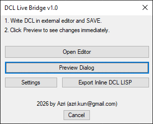
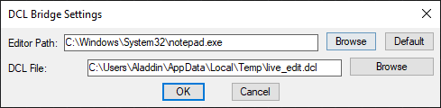
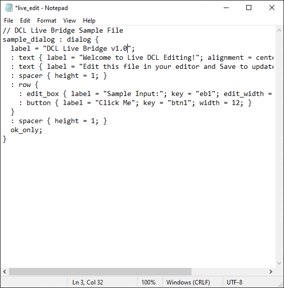
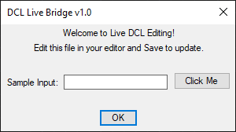
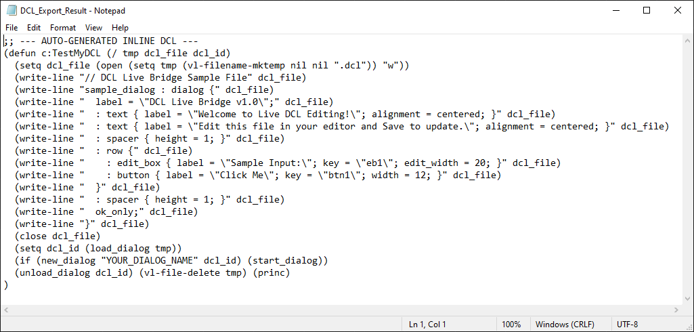

# DCL Live Bridge v1.0

**DCL Live Bridge** is a productivity tool for AutoCAD developers that provides a "Hot Reload" experience for writing Dialog Control Language (DCL). Instead of the traditional tedious cycle of saving, loading, and restarting routines, this tool allows you to see your UI changes instantly.

---

## 🚀 Features

- **Live Preview:** Edit your DCL in any external editor (VS Code, Notepad++, etc.) and see the results in AutoCAD with one click.
- **Hang-Free Export:** Automatically converts your DCL into escaped "Inline DCL LISP" code strings, ready to be pasted into your `.lsp` routines.
- **Safety Validator:** Scans your code for `is_cancel`, `ok_only`, or `done_dialog` flags to prevent "AutoCAD Lockout" (dialogs that won't close).
- **Editor Flexibility:** Browse and set any `.exe` as your preferred code editor via the settings menu.
- **Registry Persistence:** Remembers your paths and preferred editor across AutoCAD sessions.

---

## 🔍 Error Handling & Validation

DCL Live Bridge uses a **Line-by-Line Pre-Parsing Method** to validate your code before it reaches the AutoCAD DCL engine. 

### How it works:
- **Brace Tracking:** The tool counts `{` and `}` symbols. If they are not balanced, it prevents the preview to avoid a "Load Dialog Failure."
- **Semicolon Detection:** It scans every attribute assignment (lines containing `=`). If a semicolon is missing at the end of the line, it alerts you with the **exact line number** found in your text editor.
- **Safety Loop Prevention:** It ensures that an exit mechanism (like `ok_only;` or `is_cancel = true;`) is present. This prevents "Modal Lockout," where a dialog appears with no way to close it, forcing a CAD restart.

---

## 🛠️ Installation

1. Download `DCL_Live_Bridge.lsp`.
2. Drag and drop the file into AutoCAD or use the `APPLOAD` command.
3. Type **`DCLB`** to start the program.

---

## 📖 How to Use

1. **Initialize:** On the first run, the tool creates a `live_edit.dcl` sample file in your Temp folder.
2. **Configure:** Click **Settings** to select your text editor using **Browse** (e.g., VS Code or Notepad++).
3. **Edit:** Click **Open Editor**. Write your DCL code and **Save (Ctrl+S)**. You can leave this file editor open if you want.
4. **Test:** Click **Preview Dialog** in AutoCAD. The tool automatically finds your dialog name and displays it.
5. **Export:** Once satisfied, click **Export Inline LISP**. A new file will open with your DCL formatted as a LISP function.

---

## ⚠️ Important Notes

- **Dialog Names:** The previewer looks for the first `: dialog {` entry in your file. Ensure your syntax follows the standard `name : dialog { ... }` format.
- **Safety:** Always ensure your DCL includes an exit button. If the tool detects a missing exit mechanism, it will warn you before previewing to prevent AutoCAD from hanging.
- **Export Syntax:** When using the exported code, remember to replace `YOUR_DIALOG_NAME` in the generated `.lsp` file with the actual name of your dialog.

---

## 📝 Credits

**Developed by Azri (2026)** 📧 **Contact:** [azri.kun@gmail.com](mailto:azri.kun@gmail.com)

---

## ⚖️ License

This project is open-source. Feel free to fork, report issues, or suggest new features!
